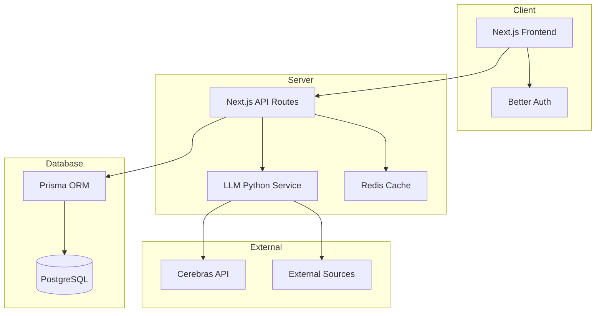

# 🌟 OpenBookLM: Democratizing Learning with AI 🌟

<!-- PROJECT SHIELDS -->
[![Contributors][contributors-shield]][contributors-url]
[![Forks][forks-shield]][forks-url]
[![Stargazers][stars-shield]][stars-url]
[![Issues][issues-shield]][issues-url]
[![MIT License][license-shield]][license-url]

<div align="center">
  <a href="https://github.com/open-biz/OpenBookLM">
    
  </a>

  <h3 align="center">OpenBookLM: Revolutionizing Content Comprehension</h3>

  <p align="center">
    Unlock the power of AI-driven learning with our open-source platform 🚀
    <br />
    <a href="https://github.com/open-biz/OpenBookLM"><strong>Explore the docs »</strong></a>
    <br />
    <br />
    <a href="https://openbooklm.com">View Demo</a>
    ·
    <a href="https://github.com/open-biz/OpenBookLM/issues">Report Bug</a>
    ·
    <a href="https://github.com/open-biz/OpenBookLM/issues">Request Feature</a>
  </p>
</div>

<!-- TABLE OF CONTENTS -->
<details>
  <summary>Table of Contents</summary>
  <ol>
    <li>
      <a href="#about-the-project">About The Project</a>
      <ul>
        <li><a href="#concept">Concept</a></li>
        <li><a href="#target-audience">Target Audience</a></li>
        <li><a href="#key-features">Key Features</a></li>
        <li><a href="#built-with">Built With</a></li>
        <li><a href="#system-architecture">System Architecture</a></li>
      </ul>
    </li>
    <li>
      <a href="#getting-started">Getting Started</a>
      <ul>
        <li><a href="#prerequisites">Prerequisites</a></li>
        <li><a href="#installation">Installation</a></li>
      </ul>
    </li>
    <li><a href="#freemium-model--guest-mode">Freemium Model & Guest Mode</a></li>
    <li><a href="#future-optimizations">Future Optimizations</a></li>
    <li><a href="#contributing">Contributing</a></li>
    <li><a href="#license">License</a></li>
    <li><a href="#contact">Contact</a></li>
  </ol>
</details>

<!-- ABOUT THE PROJECT -->
## About The Project

[![OpenBookLM Screen Shot][product-screenshot]](https://openbooklm.com)

> "OpenBookLM is a game-changer in the education sector, providing an open-source platform for AI-driven learning experiences." 🎓🌏

### Concept 📖

OpenBookLM is designed to bridge the gap between traditional learning methods and modern AI-driven approaches. Our platform empowers users to create and share interactive, audio-based courses, while leveraging the power of AI for enhanced learning experiences.

### Target Audience 🎯

- **Students** 📚
  - High school and university students
  - Graduate researchers
  - Academic professionals

- **Lifelong Learners** 🧠
  - Self-directed learners
  - Professional development enthusiasts
  - Knowledge seekers

### Key Features ✨

#### Open Source Framework 🔓
- Integration with various AI models
- Flexible and customizable architecture
- Community-driven development

#### Audio Course Creation 🎧
- Create and share educational podcasts
- Multilingual text-to-audio generation using Suno bark
- High-quality audio content management

#### Collaborative Learning 🌍
- Forum-like community system
- Course rating and refinement
- Knowledge sharing platform

#### Multilingual Support 🌐
- Overcome English-only limitations
- Support for multiple languages
- Inclusive learning environment

### System Architecture



### Built With

* [![Next][Next.js]][Next-url] (v16+)
* [![React][React.js]][React-url] (v19)
* [![Bun][Bun-badge]][Bun-url]
* [![TypeScript][TypeScript]][TypeScript-url]
* [![Tailwind][TailwindCSS]][Tailwind-url]
* [![Prisma][Prisma]][Prisma-url]
* [![PostgreSQL][PostgreSQL]][PostgreSQL-url]

## Freemium Model & Guest Mode 🆓

OpenBookLM operates on a freemium model. We believe education should be accessible to everyone immediately. Users can access the site and utilize "Guest Mode" without the friction of signing up. Guest users are assigned temporary identities using cookies and receive a limited pool of credits for audio generation, document processing, and context tokens. Once they see the value, they can easily sign in via GitHub to unlock higher limits and persistent storage via **Better Auth**.

## Future Optimizations ⚡

As OpenBookLM scales, there are several architectural paths we plan to explore to maximize speed and lower compute costs:

### 1. High-Performance Backend (Rust / Go)
Currently, our heavy text-to-audio and PDF parsing tasks are handled by a Python backend. Rewriting these specific, CPU-intensive microservices in **Rust** or **Go** could drastically reduce our memory footprint and execution time, allowing us to serve more concurrent users on cheaper hardware.

### 2. WebAssembly (Wasm) Integration
Certain parsing tasks, document vectorization, and local token counting can be shifted directly to the user's browser using **WebAssembly**. By compiling Rust/C++ libraries into Wasm, we can offload compute from our servers to the client, making the application feel instantaneous and significantly reducing our cloud hosting costs.

### 3. Edge Computing & Aggressive Caching
Leveraging Redis at the edge and pushing static LLM summaries to CDNs can ensure that repeated queries (like summarizing popular open-source books) are served in single-digit milliseconds worldwide.

## Getting Started

To get a local copy up and running, follow these steps.

### Prerequisites

* Node.js (v20 or later)
* Bun
  ```sh
  curl -fsSL https://bun.sh/install | bash
  ```
* Python (3.12 or later)
* Docker & Docker Compose (for DB and Redis)

### Installation

1. Clone the repository
   ```sh
   git clone https://github.com/open-biz/OpenBookLM.git
   ```
2. Install dependencies
   ```sh
   bun install
   ```
3. Set up Python environment
   ```sh
   ./setup/create_venv.sh
   source venv/bin/activate
   pip install -r requirements.txt
   ```
4. Set up environment variables
   ```sh
   cp .env.example .env
   ```
5. Start local services (Postgres & Redis)
   ```sh
   docker compose up -d db redis
   ```
6. Sync your database schema
   ```sh
   bunx prisma db push
   ```
7. Start the development server
   ```sh
   bun dev
   ```

<p align="right">(<a href="#readme-top">back to top</a>)</p>

## Usage

1. **Create a Notebook**: Start by creating a new notebook for your study topic (Guests can do this instantly!)
2. **Add Sources**: Upload URLs, documents, or other study materials
3. **Take Notes**: Use the AI-powered interface to take and organize notes
4. **Study & Review**: Engage with your materials through interactive features
5. **Share & Collaborate**: Join the community and share your knowledge

<p align="right">(<a href="#readme-top">back to top</a>)</p>

## Contributing

Contributions are what make the open source community such an amazing place to learn, inspire, and create. Any contributions you make are **greatly appreciated**.

Please see our [CONTRIBUTING.md](CONTRIBUTING.md) file for detailed guidelines on how to fork the repository, structure your branches, format your pull requests, and start building!

<p align="right">(<a href="#readme-top">back to top</a>)</p>

## License

Distributed under the MIT License. See `LICENSE` for more information.

<p align="right">(<a href="#readme-top">back to top</a>)</p>

## Contact

Project Link: [https://github.com/open-biz/OpenBookLM](https://github.com/open-biz/OpenBookLM)

<p align="right">(<a href="#readme-top">back to top</a>)</p>

<!-- MARKDOWN LINKS & IMAGES -->
[contributors-shield]: https://img.shields.io/github/contributors/open-biz/OpenBookLM.svg?style=for-the-badge
[contributors-url]: https://github.com/open-biz/OpenBookLM/graphs/contributors
[forks-shield]: https://img.shields.io/github/forks/open-biz/OpenBookLM.svg?style=for-the-badge
[forks-url]: https://github.com/open-biz/OpenBookLM/network/members
[stars-shield]: https://img.shields.io/github/stars/open-biz/OpenBookLM.svg?style=for-the-badge
[stars-url]: https://github.com/open-biz/OpenBookLM/stargazers
[issues-shield]: https://img.shields.io/github/issues/open-biz/OpenBookLM.svg?style=for-the-badge
[issues-url]: https://github.com/open-biz/OpenBookLM/issues
[license-shield]: https://img.shields.io/github/license/open-biz/OpenBookLM.svg?style=for-the-badge
[license-url]: https://github.com/open-biz/OpenBookLM/blob/main/LICENSE
[product-screenshot]: public/screenshot.png
[Next.js]: https://img.shields.io/badge/next.js-000000?style=for-the-badge&logo=nextdotjs&logoColor=white
[Next-url]: https://nextjs.org/
[React.js]: https://img.shields.io/badge/React-20232A?style=for-the-badge&logo=react&logoColor=61DAFB
[React-url]: https://reactjs.org/
[TypeScript]: https://img.shields.io/badge/TypeScript-007ACC?style=for-the-badge&logo=typescript&logoColor=white
[TypeScript-url]: https://www.typescriptlang.org/
[TailwindCSS]: https://img.shields.io/badge/Tailwind_CSS-38B2AC?style=for-the-badge&logo=tailwind-css&logoColor=white
[Tailwind-url]: https://tailwindcss.com/
[Prisma]: https://img.shields.io/badge/Prisma-3982CE?style=for-the-badge&logo=Prisma&logoColor=white
[Prisma-url]: https://www.prisma.io/
[PostgreSQL]: https://img.shields.io/badge/PostgreSQL-316192?style=for-the-badge&logo=postgresql&logoColor=white
[PostgreSQL-url]: https://www.postgresql.org/
[Bun-badge]: https://img.shields.io/badge/Bun-%23000000.svg?style=for-the-badge&logo=bun&logoColor=white
[Bun-url]: https://bun.sh/